# financial-dashboard

Self-hosted personal finance service that fetches bank transaction alert emails from Gmail and Fastmail, parses them into structured transactions, reconciles credit card statements, and provides a web dashboard for viewing and managing your financial data.

## Tech Stack

- **FastAPI** + Jinja2 templates + [oat.ink](https://oat.ink) CSS
- **SQLAlchemy** async + **SQLite** (aiosqlite)
- **bank-email-parser** library for email parsing (12 Indian banks, 28+ email formats)
- **cc-parser** library for CC statement PDF parsing and reconciliation
- **Fernet** symmetric encryption for stored email credentials and statement passwords
- Gmail via IMAP, Fastmail via JMAP

## Quickstart

```bash
git clone https://github.com/AkhilNarang/financial-dashboard.git
cd financial-dashboard
mkdir -p data
uv sync --no-dev
uv run python scripts/seed.py   # generates .env with Fernet key + seeds fetch rules
uv run fastapi dev      # http://localhost:8000 (with auto-reload)
```

> **Warning:** There is currently no authentication on the web UI. Only run this on
> a trusted network or behind a reverse proxy with auth.

Once running:
1. Add email sources at `/sources` (Gmail app password or Fastmail API token)
2. Assign sources to rules at `/rules` (re-run `scripts/seed.py` after adding sources to auto-link)
3. Click "Poll Now" on the dashboard or wait for automatic polling every 15 minutes

## Configuration (.env)

| Variable | Default | Description |
|----------|---------|-------------|
| `EMAIL_SOURCE_MASTER_KEY` | (required) | Fernet key for encrypting credentials at rest. If unset, an ephemeral key is generated on each startup (credentials will not survive restarts). |
| `DB_URL` | `sqlite+aiosqlite:///./data/financial_dashboard.db` | SQLAlchemy database URL |
| `POLL_INTERVAL_MINUTES` | `15` | Automatic background polling interval |
| `POLL_FETCH_LIMIT_PER_RULE` | `50` | Max new emails fetched per rule per poll cycle |
| `TELEGRAM_BOT_TOKEN` | (optional) | Telegram bot token for real-time transaction notifications |
| `TELEGRAM_CHAT_ID` | (optional) | Telegram chat ID to send notifications to |

## Key Features

### Email Fetching
- **Gmail (IMAP)**: Connects via `imap.gmail.com` using an app password. Uses a two-phase fetch: Phase 0 searches by sender/subject/date criteria to collect UIDs, Phase 1 fetches lightweight headers and X-GM-MSGID for deduplication, Phase 2 fetches full RFC822 bodies only for new messages. Deduplicates across folders using X-GM-MSGID.
- **Fastmail (JMAP)**: Uses the Fastmail JMAP API. Queries email metadata first (including blobId), checks for existing remote IDs in the DB, then downloads only new message blobs.
- **Connection pooling**: All rules on the same email source are processed in a single provider connection (one IMAP session per Gmail source, one JMAP session per Fastmail source).
- **SINCE filtering**: On incremental polls, IMAP/JMAP queries include a date filter based on `last_synced_at` minus a 2-day margin to handle delayed delivery. New rules without a prior sync use a 3-month SINCE window for their initial backfill.
- **Backfill tracking**: Each `FetchRule` has an `initial_backfill_done_at` timestamp. Rules without this value perform a 3-month historical search on their first poll; the timestamp is set once the search phase completes successfully.

### Transaction Parsing
- Emails are parsed using **bank-email-parser**, which handles 12 Indian banks (Slice, ICICI, HDFC, Axis, IndusInd, Kotak, SBI, HSBC, IDFC FIRST, Equitas, OneCard, Union Bank of India) and 28+ email formats.
- Each parsed email produces a `Transaction` row with: bank, email type, direction (debit/credit), amount, currency, date, counterparty, card/account mask, reference number (UTR/UPI), channel, and available balance.
- Failed emails are saved to `financial_dashboard/data/failed/` as `.eml` files for debugging. Files older than 7 days are auto-cleaned.

### CC Statement Reconciliation
- **Automatic via email**: Statement emails (those with "statement" in the subject and a PDF attachment) are detected during polling. The PDF is extracted, parsed with **cc-parser**, and reconciled automatically.
- **Manual upload**: PDFs can be uploaded manually at `/statements` for any configured credit card account.
- **Reconciliation**: Statement transactions are matched to existing DB transactions by `(date, amount, direction)` with a ±1 day tolerance. Results are classified as matched, missing (in statement but not DB), or extra (in DB but not statement).
- **Auto-import**: Missing transactions are automatically imported as `Transaction` rows with `email_type="cc_statement"` and `channel="cc_statement"`.
- **Narration enrichment**: For matched transactions where the DB counterparty is null or a generic placeholder (e.g. "payment received"), the statement narration is written back to the `counterparty` field.
- **Password handling**: Encrypted PDFs are tried against all stored statement passwords for the bank. If none work, the PDF is saved to `financial_dashboard/data/statements/` with status `password_required` for manual retry via the UI. Passwords can be stored per-account (encrypted with Fernet) on the account edit page and will be used for future automated processing.
- **Auto-account creation**: If no matching credit card account is found for a statement's card number, a new Account (and Card) row is created automatically.

### Account and Card Management
- **Accounts** represent bank accounts, savings accounts, or credit cards. Each has a bank, label, type, and optional account number (last-4 or full number).
- **Cards** are physical cards linked to an account. An account can have multiple cards (primary + addon cards). Each card has a `card_mask` (e.g. `XX2001`).
- **Addon card support**: Multiple cards can be linked to a single credit card account (e.g. primary + spouse addon). The linker resolves transactions to the correct card and parent account.

### Transaction-to-Account Linking (`services/linker.py`)
Every transaction is auto-linked to an Account (and optionally a Card) using a four-level lookup cascade:

1. **card_mask -> cards table** — sets both `card_id` and `account_id`. Handles all mask formats (`XX2001`, `xx0298`, `XXXXXXX8669`, `4611 XXXX XXXX 2002`, `0567`, etc.) by extracting the last-4 digits.
2. **card_mask -> accounts table** — fallback for cards stored as Account rows (e.g. debit cards with `account_number` = last-4).
3. **account_mask -> accounts table** — for savings/current account masks.
4. **bank-only fallback** — links to the sole account for a bank, but only when exactly one account exists (avoids silent misattribution when a bank has both savings and CC accounts).

Linking is performed inline during polling and in batch via the `relink_orphans()` utility.

### Encrypted Credential Storage
- Email source credentials (Gmail app password, Fastmail API token) are encrypted with Fernet before storage.
- CC statement passwords are also stored Fernet-encrypted on the Account row.
- `EMAIL_SOURCE_MASTER_KEY` in `.env` is the Fernet key. Without it, a fresh ephemeral key is generated on each startup — stored credentials become unreadable across restarts.

### Telegram Notifications
- When `TELEGRAM_BOT_TOKEN` and `TELEGRAM_CHAT_ID` are set, the app sends real-time transaction notifications to a Telegram chat after each new transaction is parsed.
- Reply to a notification message to set a note on the transaction.

### Poll Status and Progress Reporting
- `GET /api/poll/status` returns a JSON object with `state` (idle/polling), `started_at`, `finished_at`, `last_stats`, `last_error`, and a `progress` dict (`{source, rule, email, detail}`) updated as each email is processed.
- The dashboard polls this endpoint to display live progress during a poll.

### Web UI
- **Dashboard** (`/`): Month-to-date stats (debit/credit/net flow, transaction count), operational stats (total emails, active rules), recent transactions, poll status and trigger.
- **Transactions** (`/transactions`): Paginated list (50/page) with filtering by bank, account, card, direction, and date range. Sortable by date, amount, bank, or counterparty. Clicking a row opens a detail modal.
- **Transaction Notes**: Each transaction has an editable note field that auto-saves via `POST /api/transactions/{id}/note`.
- **Original Email Viewer**: Re-fetches the raw email from the provider on demand and renders the HTML body in a sandboxed iframe with restrictive CSP headers.
- **Emails** (`/emails`): Last 200 fetched emails with status (pending/parsed/failed/skipped).
- **Accounts** (`/accounts`): CRUD for bank accounts and credit cards.
- **Email Sources** (`/sources`): CRUD for Gmail/Fastmail credentials. Test connectivity with `POST /api/sources/{id}/test`.
- **Rules** (`/rules`): CRUD for fetch rules (sender, subject, folder, bank, source assignment). Rules can be enabled/disabled individually.
- **Statements** (`/statements`): CC statement upload, reconciliation view, import controls, retry with password, and reprocess-failed-emails action.

## Extensions

The dashboard ships a small **first-party extension framework**. Extensions are registered explicitly from `financial_dashboard/extensions/` — there is no plugin discovery, filesystem scan, or dynamic import. The only builtin today is **Paisa**, a ledger-data projection target ([ananthakumaran/paisa](https://github.com/ananthakumaran/paisa)).

### Architecture

- `extensions/base.py` — `ExtensionManifest` (frozen dataclass), `Capability` tags, and `ExtensionRegistrationError`.
- `extensions/registry.py` — `ExtensionRegistry`, an ordered id→manifest map that rejects duplicate ids.
- `extensions/__init__.py` — `BUILTIN_EXTENSIONS` and `register_builtin_extensions()`, called from the app lifespan so contributed `SettingDef` entries land in `services.settings` before `load_all_settings()`.
- `services/extensions.py` — `ExtensionManager` (the per-app registry holder stored on `app.state.extension_manager`) and `bootstrap_extensions()`.
- `services/paisa/` — the Paisa integration (config / renderer / projection / publisher / orchestrator), layered so each concern is independently testable.

Each manifest advertises capability tags. Paisa advertises `setting_contribution`, `http_read` (read Paisa config/diagnosis over HTTP), and `projection` (project ledger data into Paisa). A `synthetic_generation` tag exists but is not yet active.

### Paisa

Paisa projection runs in one of three **modes** (`paisa.mode`), which **coexist** with the native dashboard — enabling Paisa never changes how transactions are ingested, linked, categorized, or snapshotted:

| Mode | What it does | Network |
|------|--------------|---------|
| `disabled` | Inactive (default). No reads, no writes. | none |
| `connect` | Read-only probe of a running Paisa instance (powers the status badge). | HTTP GET only |
| `project` | `connect` + project ledger data into a dashboard-owned generated include file; on Sync, ask Paisa to reload. | HTTP GET + POST reload |

Paisa **never** mutates native rows (`accounts`, `transactions`, …) — projection is a one-way read of core data into a ledger file. `project` mode also requires a `paisa.project_since` ISO-date cutover (the opening-balance date).

#### Setup: a generated include, never your main journal

The dashboard writes a **generated include file** at `paisa.generated_path`. You add a single `include` line to your **main Paisa journal** once; the dashboard overwrites only the generated file on every Generate/Sync, and Paisa picks it up on reload. **Never point `generated_path` at your main journal** — the dashboard overwrites it.

```
include /absolute/path/to/financial-dashboard.journal
```

The parent directory of `generated_path` must already exist; it is never created for you. Non-INR transactions are handled by `paisa.non_inr_policy`: `skip` (default) drops them; `priced` emits them in their own commodity plus a price directive when a `paisa.fx_rates` rate is configured for the date, reporting `missing_fx_rate` otherwise. The projection backend is selected by `paisa.ledger_cli` (`ledger` | `hledger` | `beancount`); a manual sync requires the upstream Paisa instance to use the same backend.

Account openings are INR-only. The projection selects only an explicitly `INR` `BalanceSnapshot`; an explicit USD/EUR snapshot (and an unknown legacy NULL snapshot) is never relabelled as INR. The running-balance fallback likewise accepts only an INR transaction, with `transactions.currency IS NULL` treated as the documented pre-column legacy representation of INR.

**Net-worth scope is explicit, not implied.** The account picker selects only `Account` rows, while native net worth also contains CAS portfolios and active manual assets/liabilities whose snapshots have no `account_id`. Every preview/generate/sync summary therefore reports deterministic CAS/manual counts and labels plus `cas_investment_scope` (`none`/`excluded`/`partial`/`included`) and `net_worth_scope_complete`. `paisa.project_investments=false` explicitly marks CAS excluded. When enabled, CAS is `included` only when surviving canonical lots and explicit latest quantities/prices cover the active portfolio; value-only positions, quantity mismatches, missing/conflicting current prices, or suppressed lots make it `partial`. Manual items remain prominently outside projection because there is no manual-item selection/mapping contract; the dashboard never silently includes all private manual sources or fabricates dates/accounts for them.

#### Routes

HTML (`web/extensions.py`) — all Paisa mutations are POST-Redirect-GET; failures land in `?saved=/?generated=/?synced=/?outcome=/?error=` flashes:

| Method | Path | Purpose |
|--------|------|---------|
| `GET` | `/extensions` | Extension list. |
| `GET` | `/extensions/paisa` | Paisa configuration page (connection, rendering/FX, automation, accounts, mappings). |
| `POST` | `/extensions/paisa` | Save config (valid → 303, invalid → 422 re-render). |
| `POST` | `/extensions/paisa/generate` | Write the generated include (`project` only, audited). |
| `POST` | `/extensions/paisa/sync` | Generate + ask Paisa to reload (`project` only, audited). |
| `GET` | `/extensions/paisa/audit` | Recent operation audit log (manual + automatic). |
| `GET` | `/extensions/paisa/reports/{report}` | Curated report page (budget/allocation/recurring/income_statement/liabilities); fetched client-side. |
| `GET` | `/extensions/paisa/reconciliation` | Side-by-side local/native/Paisa reconciliation; read-only. |

JSON (`api/extensions.py`) — probe/preview/generate/sync failures are caught into typed `ok=false` bodies, never a 500:

| Method | Path | Purpose |
|--------|------|---------|
| `GET` | `/api/extensions` | List extension manifests. |
| `GET` | `/api/extensions/paisa/config` | Redacted config (password never returned). |
| `POST` | `/api/extensions/paisa/config` | Save config. |
| `GET` | `/api/extensions/paisa/accounts` | Account picker choices. |
| `GET` | `/api/extensions/paisa/status` | Probe Paisa (`connect`/`project`). Read-only. |
| `POST` | `/api/extensions/paisa/probe` | Explicit probe (audited). |
| `POST` | `/api/extensions/paisa/preview` | Render projection journal (`project` only). |
| `POST` | `/api/extensions/paisa/generate` | Write include file (`project` only, audited). |
| `POST` | `/api/extensions/paisa/sync` | Generate + reload (`project` only, audited). |
| `GET` | `/api/extensions/paisa/audit` | Recent `ExtensionRun` rows + last success/error. |
| `GET` | `/api/extensions/paisa/reports/{report}` | One curated report via the per-app TTL cache. |
| `GET` | `/api/extensions/paisa/reconciliation` | Read-only reconciliation view. |

#### Curated reports, audit & reconciliation

- **Curated reports.** `connect`/`project` modes can read Paisa's v0.7.4 `/api/budget`, `/api/allocation`, `/api/recurring`, `/api/income_statement` and `/api/liabilities/balance` endpoints. Responses are normalized into dashboard-owned typed DTOs in `integrations/paisa.py` — no raw upstream payload is ever proxied. Reads are served from a **per-application TTL cache** (`paisa.report_cache_ttl_seconds`; 0 disables caching) that **coalesces concurrent requests** into one upstream call, so a burst of page opens cannot blow Paisa's 6-req/min auth rate limit. `disabled` mode makes zero upstream calls.
- **Audit.** Every manual generate/sync/probe and every automatic sync records a start/complete `ExtensionRun` row (operation, trigger, outcome, emitted/skipped counts, output hash, duration, sanitized error). `details` carries only safe summary fields — never credentials or raw journal text.
- **Reconciliation.** `/extensions/paisa/reconciliation` shows, per selected account: the local projection diagnostics (unknown/unmatched/missing-FX/card-clearing), projected ending balances, the latest native `BalanceSnapshot`, and the curated Paisa balance. The native ↔ Paisa join is **only** by explicit `paisa.account_mappings`; there is no fuzzy matching, and the view writes nothing — it never corrects or mutates a core row. Mapping suggestions are preview-only deterministic defaults that must be accepted through the normal config-save path.

#### Auto sync

When `paisa.auto_sync_enabled=true` and the mode is `project`, a coordinator keeps the generated Paisa include in sync with core data using **transaction-driven coalescing** rather than a per-fetch hook. (In `disabled`/`connect` the coordinator does no I/O — see the last bullet.)

- **Dirty detection — exact post-commit semantics.** SQLite AFTER triggers on the tables the projection reads — `transactions`, `accounts`, `cards`, `balance_snapshots`, `investment_lots`, `cas_uploads` (insert/update/delete) and `settings` (`paisa.%` keys only) — atomically bump `extension_sync_state.desired_revision` and maintain `first_dirty_at`/`last_dirty_at`. The bump shares the dirtying write's transaction, so it commits or rolls back *together* with it (a rolled-back savepoint drops only its own bump); the coordinator never observes a revision for an uncommitted change. A `paisa.%` settings change additionally resets the retry backoff.
- **Full-journal `/api/sync`.** Paisa exposes no per-transaction/partial sync API, so each reconcile re-generates the whole include file and asks Paisa to reload the full journal. A bulk statement import (≈200 rows) lands as one outer commit, so it produces exactly one dirty bump and one coalesced reload — not one per row.
- **Coalescing + latency (fixed).** A 5s quiet debounce groups a burst of dirtying writes into one reload; a 30s maximum dirty latency guarantees a reload is triggered even if writes keep coming. The coordinator polls `extension_sync_state` every 2s.
- **Single-flight.** A lease on `extension_sync_state` (`lease_owner`/`lease_token`/`lease_expires_at`) ensures at most one coordinator reconciles at a time.
- **Retry + force reload (fixed).** A failed remote reload backs off `1/2/5/10/15` minutes (`next_attempt_at`/`failure_count`); a `paisa.%` settings change resets the backoff so a config fix is retried immediately. A six-hour force reload (`force_reload`) periodically reconciles even with no observable drift, so a silent out-of-band Paisa change is corrected.
- **Hard minimum interval (the only tunable knob).** `paisa.auto_sync_min_interval_minutes` (default **1**) is a hard floor between remote reloads/retries only — it is **not** the event debounce (5s) or the max latency (30s), both fixed. A value of 1 reloads as soon as the coordinator allows; a higher value throttles a healthy stream and a failing one alike. Existing persisted values are preserved across upgrades.
- **disabled/connect.** The triggers still bump `desired_revision` in `disabled`/`connect`, so dirty state accumulates with no I/O — the coordinator performs no projection, file, or network work until `project` mode + auto-sync is on. The bump is cheap and nothing is lost.
- **Audited + failure-isolated.** Each reconcile records an `ExtensionRun` row; any exception is caught and swallowed so it can never break polling. When `paisa.notify_sync_failures=true`, repeated *identical* failures are deduped via a fingerprint in the audit `details` (`notify_fp`); a changed failure notifies again.

#### Constraints & caveats

- **Paisa 0.7.4 / supported backends.** Projection targets the `ananthakumaran/paisa:0.7.4` config schema. Every generated entry balances to zero and uses `:`-joined account hierarchies; a manual sync requires the upstream Paisa `ledger_cli` to equal the configured `paisa.ledger_cli` (one of `ledger`/`hledger`/`beancount`) — a mismatch is rejected up front with `outcome=unsupported_backend`.
- **Readonly sync caveat.** A readonly Paisa instance would acknowledge `/api/sync` with fake success, so Sync probes capabilities first: a `readonly: true` instance is refused up front with `outcome=readonly` — the include file is **not** written and Paisa's state is untouched. Restart Paisa without readonly to sync.
- **Diagnosis classification (contra-expense acceptance).** Paisa v0.7.4's doctor (`internal/server/doctor.go`) emits a `Debit Entry` danger for *every* negative `Expenses:` posting — including our intentional contra-expense postings (refunds, cashback, fee reversals) that make reversals net rather than relabel as Income. Paisa exposes **no** config flag to disable or allowlist these checks (the rules are hardcoded and scan the whole journal), so Sync classifies the post-sync diagnosis against a multiset of expected `(account, date, amount)` fingerprints derived from the generated `ProjectionReport` (one per negative Expenses posting the projection produced). A `Debit Entry` whose parsed fingerprint exactly matches (up to the expected multiplicity) is *accepted* and does not fail the sync; an unmatched `Debit Entry` (an operator-authored negative Expenses posting, an extra beyond multiplicity), any unparseable issue, and **every** other danger kind (`Negative Balance`, `Credit Entry`, `Exchange Price Missing`) stay *fatal* (`outcome=diagnosis_failed`). The sync response and audit expose additive `diagnosis_expected`/`diagnosis_accepted`/`diagnosis_fatal` counts (no raw journal text or credentials). Probe status is unaffected — it still surfaces the raw upstream diagnosis so an operator can see everything Paisa reports.

#### Dashboard accounting taxonomy & canonical metadata

The projection roots each transaction's contra account by **dashboard category semantics**, not by direction alone — this is what makes reversals net correctly and keeps asset movements out of the P&L:

| Category slug(s) | Contra root | `dashboard_kind` | Notes |
|---|---|---|---|
| `salary`, `interest`, `other_income` | `Income:<Title>` | `income` | Always Income (credit-normal); a debit is a reversal that nets. |
| `groceries`, `dining`, `fuel`, `fees_charges`, … | `Expenses:<Title>` | `expense` | **Always** Expenses — a credit on an expense slug is a reversal that nets against the expense, never relabelled as Income. |
| `refund`, `cashback_rewards` | `Expenses:<Title>` | `contra_expense` | Contra-expense: negative Expenses on credit (money back), netting against the original spend. |
| `investment`, `investment_redemption` | `Assets:Investments:Unallocated` | `investment` | Asset movement (bank ↔ investments), never expense or income. |
| `repayment` | `Equity:Transfers In` | `repayment` | Non-income equity clearing — somebody paying you back is not earned income. |
| `emi_loan`, `cash_withdrawal` | `Expenses:<Title>` | `expense` | **Imprecise**: no principal/interest split or cash/loan account in the source row. Conservative Expenses clearing + `imprecise_count` diagnostic; no fabricated accounts. |
| `self_transfer` | *(paired transfer)* | `self_transfer` | Special-cased: a matched debit+credit pair is one balanced transfer. |
| `credit_card_payment` | specific liability or `Liabilities:Credit Card` | `card_payment` | Card resolution (see below). |
| `unknown`, blank | `Expenses:Unknown` | `unknown` | Suspense contra; counted in `unknown_count`. |

Operator `paisa.category_mappings` overrides **always** win, even for special categories.

**Card payment traceability.** A bank-side `credit_card_payment` resolves to a specific selected liability when the row carries an explicit selected `card_id` or an exact `card_mask` that identifies exactly one selected Card. The same mask on multiple selected cards is `dashboard_card_resolution=ambiguous_mask` and uses generic clearing; it is never query-order/last-write-wins. Other misses use `dashboard_card_resolution=unresolved`. **Never** fuzzy/partial matching. `dashboard_card_ids` contains only actual `Card.id` values; the bank and resolved liability `Account.id` values stay under `dashboard_account_ids`, even when the two numeric id spaces collide.

**Investment funding double-count prevention.** When investment-lot projection is enabled and a bank investment transaction provably funds an emitted lot, the bank leg's contra is remapped to `Equity:Opening Balances:Investment` so the investment asset is counted once (in the lot). Provable means: an exact reference that maps to a single instrument, **or** an exact date+amount that deterministically matches a single instrument. A reference shared by multiple instruments does **not** early-abort — it falls through to the deterministic date+amount check, which may still disambiguate and remap. If the link is only *potential* (a shared reference with no deterministic date+amount, or a date-only/amount-only collision), the matching lots are suppressed conservatively and any suppressed instrument's price directive is dropped so no orphan `P`/`price` line lingers.

**Canonical lots and current CAS value.** Projection consumes the investment service's canonical acquisition multiset and canonical exact-only disposal consumption. The same acquisition repeated by overlapping CAS periods emits once, while genuine repeated equal source occurrences retain multiplicity. Acquisition unit cost remains the lot cost annotation and is never overwritten by current value. Separately, latest explicit CAS NAV/unit-price facts emit dated market-price directives for surviving commodities. Equal commodity/date prices across folios/demat accounts deduplicate; conflicting values suppress the whole key with a diagnostic rather than picking one. Fully consumed/suppressed/value-only holdings leave no orphan price. Folio/demat identities remain visible in deterministic valuation diagnostics, while canonical lot metadata retains portfolio, source occurrence, all contributing upload ids, and depository provenance without creating duplicate commodity holdings.

**Canonical metadata schema.** Every generated entry carries a closed `dashboard_*` metadata schema so any ledger line drills back to its source. **Transaction-derived entries** (standard, reversal, FX, self-transfer, card-payment) carry the full schema; **source-less entries** (opening, investment-lot) carry a *reduced* schema — they have no dashboard Transaction, so they do not carry transaction-only fields (`dashboard_txn_ids`, `dashboard_category`, `dashboard_channel`, `dashboard_email_type`, `dashboard_card_ids`).

Full schema (transaction-derived entries):

| Key | Value | Example |
|---|---|---|
| `dashboard_txn_ids` | pipe-separated `txn-<id>` | `txn-1|txn-2` |
| `dashboard_kind` | closed taxonomy | `expense` |
| `dashboard_category` | the raw category slug | `groceries` |
| `dashboard_source` | transaction source | `email` |
| `dashboard_channel` | transaction channel | `email` |
| `dashboard_email_type` | parser email type | `debit_purchase` |
| `dashboard_account_ids` | pipe-separated account ids | `1|3` |
| `dashboard_card_ids` | pipe-separated card ids | `10` |
| `dashboard_reference` | sanitized reference (when present) | `UTR12345` |

Reduced schema (source-less entries):

| Entry kind | Keys | Example |
|---|---|---|
| opening (posting-level) | `dashboard_account_ids`, `dashboard_source`, `dashboard_as_of` | `1`, `snapshot`, `2025-12-31` |
| investment-lot (entry-level) | `dashboard_kind`, `dashboard_instrument`, `dashboard_acquired_on`, `dashboard_portfolio_key`, `dashboard_source_occurrence`, `dashboard_cas_upload_ids`, `dashboard_depository_sources`, plus canonical `dashboard_cas_upload_id`/`dashboard_source_ref`/`dashboard_reference` when present | `investment_lot`, `INE000A01018`, `2026-01-15`, `PAN`, `0` |

- **Ledger/hledger**: one `; key: value` tag per line (space after colon, no comma separator).
- **Beancount**: lowercase `key: "value"` metadata (quoted strings).
- Backward-compatible `txn: <id|id>` tag preserved for existing drill-through tooling (transaction-derived entries only — openings/lots have no dashboard txn id).
- Values are sanitized: no secrets, raw email/SMS bodies, or full card/account masks. Metadata is validated through real beancount `loader.load_string` meta identity (standard, opening, lot, resolved/unresolved card-payment and FX entries — not substring matching) and real `ledger`/`hledger` tag queries where the binaries are available.
- The generated file header carries `; version: 3` (bumped from 2 for the metadata schema).

#### Security & network

- **Localhost by default.** `paisa.allow_remote=false` rejects non-localhost Paisa URLs; remote targets additionally require HTTPS (enforced on save).
- **Credentials are Fernet-encrypted** at rest (`paisa.auth_password`); the password is never returned by any API (only an `auth_password_set` flag), and a blank password on save preserves the existing secret.
- **Safe deep link.** The "Open Paisa" link is re-validated as `http`/`https` on every render, so a stored `javascript:` value can never produce a script `href`.
- **Status is fetched client-side** so a down/slow Paisa never blocks a page render. The status badge is built via DOM APIs (`createElement`/`classList`/`replaceChildren` + a text node), never `innerHTML`, so a misconfigured or hostile upstream string in `mode`/`label`/`reason` cannot inject markup.
- **Flash query values are URL-encoded** so spaces, `&`, `#`, or Unicode in an error/outcome flash can never corrupt the redirect `Location` header.
- **Optional dashboard auth.** The web UI uses HTTP basic auth only when `AUTH_USERNAME`/`AUTH_PASSWORD` are set (off by default); otherwise run on a trusted network or behind a reverse proxy with auth.

### Synthetic data & contract probe

`scripts/synth/` generates a **deterministic, offline** Paisa 0.7.4 corpus plus a synthetic dashboard seed. It never touches a production database — the loader writes only to a dedicated `data/synthetic/<profile>/synthetic.db` guarded by path checks and a destructive-reset confirmation.

```bash
uv run python -m scripts.synth generate   # write corpus + checksummed manifest
uv run python -m scripts.synth load       # load the scenario into the synthetic DB
uv run python -m scripts.synth verify     # recompute checksums/counts; detect tampering
uv run python -m scripts.synth reset --reset --confirm-reset yes-delete-the-synthetic-db
```

`scripts/paisa_contract.py` is an **optional** probe (not in the default test suite; needs Docker + a one-time image pull). It builds the golden corpus, mounts it into the pinned `ananthakumaran/paisa:v0.7.4` container, and runs Paisa's real journal-sync path (`paisa --config /data/paisa.yaml --now <date> update --journal`) to confirm the generated journal parses under a genuine Paisa + `ledger` CLI. The dashboard runtime **never** spawns Paisa — this is a developer-side verification tool only.

```bash
uv run python scripts/paisa_contract.py [--skip-if-unavailable]
```

## Architecture Overview

```
financial_dashboard/
  main.py         # FastAPI app factory and lifespan wiring
  api/            # JSON endpoints (incl. api/extensions.py)
  web/
    __init__.py   # Stable web router aggregation
    dashboard.py / accounts.py / sources.py / rules.py / transactions.py
    emails.py / statements.py / bank_statements.py / settings.py / polling.py
    extensions.py # /extensions + /extensions/paisa HTML surface
    forms.py
  extensions/     # First-party extension framework (manifest/registry; no plugins)
  services/       # Domain services
    extensions.py # ExtensionManager (app.state) + bootstrap_extensions()
    paisa/        # Paisa projection integration (config/renderer/projection/...)
    statements/   # CC + bank statement subpackage
  schemas/        # Pydantic DTOs
  integrations/   # Parser + email provider adapters
  core/           # Shared templating, auth, crypto, date, and deps helpers
  db/             # Engine/session setup, models, enums, init_db glue
  templates/      # Jinja2 HTML templates
  static/         # CSS, JS
  data/
    failed/       # Failed email spool (.eml files, auto-cleaned after 7 days)
    statements/   # Saved CC statement PDFs
scripts/
  main.py         # raw-email dev CLI
  seed.py
  populate.py
  synth/          # Deterministic synthetic seed + offline Paisa 0.7.4 corpus generator
  paisa_contract.py  # optional Docker probe against ananthakumaran/paisa:v0.7.4
```

### Request Lifecycle

1. FastAPI `lifespan` in `financial_dashboard.main` bootstraps builtin extensions (`bootstrap_extensions()`, so contributed `paisa.*` settings exist before settings load, and first-party runtimes are attached), initializes the DB, starts support services, starts extension runtimes (`ExtensionManager.startup_all()`), and stores a shared `FetchService` (wired with the manager) on `app.state`.
2. On each poll tick (or manual trigger), `FetchService.poll_all()` delegates to `integrations/email/orchestrator.py`. After native polling, reminders, and categorization complete, the loop invokes `ExtensionManager.after_fetch_cycle_all()` once; failures are isolated per extension so they can never break polling. Automatic Paisa sync is **not** a per-fetch hook — the lifespan starts each extension's own runtime (`ExtensionManager.startup_all()`), and the Paisa runtime is a coalesced, transaction-driven coordinator (see [Paisa → Auto sync](#auto-sync)). On teardown the lifespan stops the poll loop, then `ExtensionManager.shutdown_all()`.
3. HTML routes are split by domain under `web/` and aggregated by `web/__init__.py`.
4. Routes use `core.deps.get_session`, while supporting services live under `services/`.
5. During email processing the app:
    - Tries `_process_email()` (bank-email-parser).
    - On failure, tries `process_statement_email()` (cc-parser PDF path).
    - Saves `Email` row and, if successful, `Transaction` row.
    - Calls `link_transaction()` to set `account_id`/`card_id`.
6. JSON endpoints live under `api/`, while HTML routes render Jinja templates from `web/{domain}.py` and delegate to `services/`.

## Database Models

| Model | Table | Purpose |
|-------|-------|---------|
| `EmailSource` | `email_sources` | Gmail/Fastmail account with encrypted credentials and sync cursor |
| `FetchRule` | `fetch_rules` | Sender/subject/folder/bank match rule linked to a source |
| `Email` | `emails` | One row per fetched email; tracks parse status and links to a rule |
| `Transaction` | `transactions` | Parsed financial transaction; links to email, account, card |
| `Account` | `accounts` | Bank account, savings account, or credit card |
| `Card` | `cards` | Physical payment card linked to an account (supports addon cards) |
| `StatementUpload` | `statement_uploads` | CC statement PDF upload with reconciliation results stored as JSON |
| `BankStatementUpload` | `bank_statement_uploads` | Bank statement PDF upload with reconciliation results stored as JSON |
| `CasUpload` | `cas_uploads` | Imported depository CAS portfolio statement and reconciliation metadata |
| `BalanceSnapshot` | `balance_snapshots` | Point-in-time asset/liability value emitted by bank, CC, CAS, or manual sources |
| `SnapshotHolding` | `snapshot_holdings` | Asset-class breakdown rows for investment snapshots; optional nullable instrument detail (ISIN/quantity/unit price/currency/cost basis/acquired on) a CAS payload states for a priced instrument |
| `InvestmentLot` | `investment_lots` | Complete, capital-gains-eligible investment lot normalized from an explicit CAS acquisition fact (MF purchase with units+nav+amount+date+isin); source occurrences and overlapping-upload provenance are retained, and current valuation stays separate from acquisition cost |
| `ManualItem` | `manual_items` | User-maintained asset/liability sources such as property, cash, or loans |
| `Category` | `categories` | Controlled vocabulary of transaction category slugs (editable; seeded at init) |
| `MerchantRule` | `merchant_rules` | Editable substring→category rules; the deterministic layer that skips the LLM for known merchants |
| `Setting` | `settings` | Small key/value store for app-level settings |
| `ExtensionRun` | `extension_runs` | Audit/state row for a single extension operation (probe/generate/sync, manual or automatic); generic over `extension_id`, stores no credentials and never duplicates financial rows |
| `ExtensionSyncState` | `extension_sync_state` | Per-extension current sync-state singleton (Paisa today): trigger-bumped `desired_revision` vs coordinator-advanced `applied_revision`, dirty window, published/remote/healthy hashes, retry backoff, diagnosis state, one-shot force-reload flag, and a single-flight lease. Exactly one row per extension; never stores credentials or duplicates financial rows |

### Schema Diagram

```mermaid
erDiagram
    EMAIL_SOURCES {
        int id PK
        string provider
        string label
        string account_identifier
        string credentials
        bool active
        string sync_cursor
        datetime last_synced_at
        string last_error
    }

    ACCOUNTS {
        int id PK
        string bank
        string label
        string type
        string account_number
        string statement_password
        string statement_password_hint
        bool active
    }

    CARDS {
        int id PK
        int account_id FK
        string card_mask
        string label
        bool is_primary
        bool active
    }

    FETCH_RULES {
        int id PK
        string provider
        int source_id FK
        string sender
        string subject
        string bank
        string folder
        string email_kind
        bool enabled
        datetime initial_backfill_done_at
    }

    EMAILS {
        int id PK
        string provider
        string message_id
        int source_id FK
        string remote_id
        string sender
        string subject
        datetime received_at
        datetime fetched_at
        string status
        text error
        int rule_id FK
    }

    STATEMENT_UPLOADS {
        int id PK
        int account_id FK
        int email_id FK
        string bank
        string filename
        string file_path
        string source_kind
        string status
        string card_number
        string statement_name
        string due_date
        string total_amount_due
        string minimum_amount_due
        int parsed_txn_count
        int matched_count
        int missing_count
        int imported_count
        text reconciliation_data
        text error
        datetime created_at
        string payment_status
        text payment_sent_offsets
        datetime payment_last_reminded_at
        decimal payment_paid_amount
        datetime payment_paid_at
    }

    BANK_STATEMENT_UPLOADS {
        int id PK
        int account_id FK
        int email_id FK
        string bank
        string filename
        string file_path
        string status
        string account_number
        string account_holder_name
        string opening_balance
        string closing_balance
        string statement_period_start
        string statement_period_end
        int parsed_txn_count
        int matched_count
        int missing_count
        int imported_count
        text reconciliation_data
        text error
        datetime created_at
    }

    CAS_UPLOADS {
        int id PK
        int email_id FK
        string portfolio_key
        string depository_source
        string investor_name
        date statement_date
        decimal grand_total
        bool portfolio_ok
        decimal portfolio_delta
        text raw_holdings_json
        datetime created_at
    }

    MANUAL_ITEMS {
        int id PK
        string name
        string kind
        string category
        bool active
        text notes
        datetime created_at
    }

    BALANCE_SNAPSHOTS {
        int id PK
        int account_id FK
        int cas_upload_id FK
        int manual_item_id FK
        string portfolio_key
        string kind
        string category
        date as_of_date
        decimal value
        string source
        string currency
        datetime created_at
    }

    SNAPSHOT_HOLDINGS {
        int id PK
        int snapshot_id FK
        string asset_class
        string label
        decimal value
        string instrument_id
        decimal quantity
        decimal unit_price
        string currency
        decimal cost_basis
        date acquired_on
    }

    INVESTMENT_LOTS {
        int id PK
        int cas_upload_id FK
        string instrument_id
        string instrument_name
        decimal quantity
        decimal unit_cost
        decimal cost_basis
        string currency
        date acquired_on
        string source_ref
        string transaction_type
        string reference
        int source_occurrence
        datetime created_at
    }

    SETTINGS {
        string key PK
        text value
        datetime updated_at
    }

    EXTENSION_RUNS {
        int id PK
        string extension_id
        string operation
        string status
        string outcome
        string trigger
        datetime started_at
        datetime completed_at
        string input_hash
        string output_hash
        int emitted_count
        int skipped_count
        text details
        text error
    }

    EXTENSION_SYNC_STATE {
        string extension_id PK
        int desired_revision
        int applied_revision
        datetime first_dirty_at
        datetime last_dirty_at
        string last_published_hash
        string last_remote_hash
        string last_healthy_hash
        datetime last_remote_attempt_at
        datetime next_attempt_at
        int failure_count
        string diagnosis_state
        bool force_reload
        string lease_owner
        string lease_token
        datetime lease_expires_at
        datetime created_at
        datetime updated_at
    }

    TRANSACTIONS {
        int id PK
        int email_id FK
        int account_id FK
        int card_id FK
        int statement_upload_id FK
        int bank_statement_upload_id FK
        string bank
        string email_type
        string direction
        decimal amount
        string currency
        date transaction_date
        time transaction_time
        string counterparty
        string card_mask
        string account_mask
        string reference_number
        string channel
        decimal balance
        text raw_description
        text note
        string category
        string category_method
        float category_confidence
        string category_model
        string category_input_hash
        int category_vocab_version
        datetime categorized_at
        string review_status
        text review_reason
        datetime last_notified_at
        int notify_attempts
        datetime created_at
    }

    CATEGORIES {
        int id PK
        string slug UK
        string display_label
        bool active
        datetime created_at
    }

    MERCHANT_RULES {
        int id PK
        string pattern UK
        string category
        bool active
        int priority
        datetime created_at
    }

    ACCOUNTS ||--o{ CARDS : has
    EMAIL_SOURCES ||--o{ FETCH_RULES : assigned_to
    EMAIL_SOURCES ||--o{ EMAILS : fetched_from
    FETCH_RULES ||--o{ EMAILS : matched_by
    ACCOUNTS ||--o{ STATEMENT_UPLOADS : owns
    EMAILS ||--o{ STATEMENT_UPLOADS : originates
    ACCOUNTS ||--o{ BANK_STATEMENT_UPLOADS : owns
    EMAILS ||--o{ BANK_STATEMENT_UPLOADS : originates
    EMAILS ||--o{ CAS_UPLOADS : originates
    ACCOUNTS ||--o{ BALANCE_SNAPSHOTS : emits
    CAS_UPLOADS ||--o{ BALANCE_SNAPSHOTS : emits
    CAS_UPLOADS ||--o{ INVESTMENT_LOTS : normalizes_lots
    MANUAL_ITEMS ||--o{ BALANCE_SNAPSHOTS : emits
    BALANCE_SNAPSHOTS ||--o{ SNAPSHOT_HOLDINGS : breaks_down
    EMAILS ||--o{ TRANSACTIONS : produces
    ACCOUNTS ||--o{ TRANSACTIONS : linked_account
    CARDS ||--o{ TRANSACTIONS : linked_card
    STATEMENT_UPLOADS ||--o{ TRANSACTIONS : imported_from_cc_statement
    BANK_STATEMENT_UPLOADS ||--o{ TRANSACTIONS : imported_from_bank_statement
    CATEGORIES ||--o{ TRANSACTIONS : categorizes
```



`transactions.category` references `categories.slug` as a soft (application-enforced) link — SQLite foreign-key enforcement is intentionally off, so there is no DB-level FK constraint.

Relationship notes:
- `transactions.account_id` and `transactions.card_id` are the canonical account/card links after the linker runs; `card_mask` and `account_mask` remain as parser-derived denormalized hints.
- `balance_snapshots.portfolio_key` is a CAS forward-fill key for investment rows, not a foreign key. Parser/linker hints such as `card_mask` and `account_mask` remain denormalized text.
- `settings` is intentionally standalone and has no foreign-key links.
- `extension_runs` is intentionally standalone: `extension_id` is a free-form string matching a registered extension manifest id (today only `paisa`), not a foreign key. It records what an extension did (operation/status/outcome/counts/hashes) and never stores credentials or duplicates financial rows.
- `extension_sync_state` is likewise a standalone singleton keyed by `extension_id` (a free-form string, today only `paisa`), not a foreign key. It records where each extension's reconciled state is *right now* (desired vs applied revision, dirty window, hashes, retry backoff, diagnosis, lease) — exactly one row per extension, never growing with operation count. `extension_runs` is the per-operation audit log; this row is the per-extension current state.
- Several foreign keys are nullable (`fetch_rules.source_id`, `emails.source_id`, `emails.rule_id`, and the upload/transaction linkage columns), so rows can exist before the related record is known.

### Key Constraints
- `emails.message_id` is globally unique (prevents re-inserting the same email).
- `(source_id, remote_id)` is unique on `emails` (provider-scoped deduplication).
- `transactions` has a partial unique index on `(bank, reference_number, direction)` where `reference_number IS NOT NULL` (deduplicates transactions with known UTR/UPI reference numbers; direction is included so a debit and credit sharing a ref don't collide).
- `transactions` also has a partial lookup index on `reference_number` where it is non-null; ingest uses it to find an opposite-direction leg on a different linked or masked account and mark both transactions as `self_transfer`.
- `transactions` has a composite lookup index on `(category, transaction_date)`. Category first because a category filter with no date bounds — a drill-through from a category link, say — would otherwise scan the table, both for the rows and for the `count()` the pager needs; `transaction_date` second so a filter carrying both a category and a date range satisfies them from the one index instead of narrowing on dates and re-checking the category per row.
- `(account_id, card_mask)` is unique on `cards`.
- `balance_snapshots` has a check constraint requiring exactly one source foreign key among `account_id`, `cas_upload_id`, and `manual_item_id`.
- `balance_snapshots` has SQLite partial unique indexes for account, investment, and manual snapshot upserts: `(account_id, category, as_of_date)`, `(portfolio_key, category, as_of_date)`, and `(manual_item_id, as_of_date)`.
- `(portfolio_key, statement_date)` is unique on `cas_uploads` so re-importing the same CAS period replaces the prior upload.
- `investment_lots` carries a natural unique key `(cas_upload_id, source_ref, instrument_id, acquired_on, reference, source_occurrence)`. `source_occurrence` preserves genuine multiplicity inside one source statement, while idempotent normalization cannot insert the same occurrence twice. Rows repeated by overlapping CAS periods remain attached to every contributing upload; the investment service exposes a deterministic canonical multiset keyed by portfolio/source transaction identity/instrument/date/reference/quantity/cost and retains all contributing upload provenance. A lot is only created when the source states quantity, per-unit cost, cost basis, currency and acquisition date explicitly and consistently (`quantity * unit_cost == cost_basis` to the penny); value-only holdings and demat movements (CAS prints no cost) are excluded and reported as diagnostics, never fabricated into a lot. Acquisition cost facts are never derived from a current NAV/value. Current valuation facts are read separately from the latest statement per portfolio and preserve demat-account/folio identity even when the same ISIN is held in several sources.
- `snapshot_holdings` has nullable investment-detail columns (`instrument_id`, `quantity`, `unit_price`, `currency`, `cost_basis`, `acquired_on`). CAS ingestion still aggregates holdings by asset class for the net-worth breakdown, so these stay NULL on those rows; they are populated only when a holding represents a single instrument the CAS explicitly priced.
- `extension_runs` has composite lookup indexes on `(extension_id, started_at)` (the hot "most recent runs for this extension" + the automatic-sync debounce lookup) and `(extension_id, status)`, plus `(operation)`, so recent-run and failure queries seek instead of scanning.
- `extension_sync_state` is a standalone singleton (one row per `extension_id`, today only `paisa`). CHECK constraints require non-negative `desired_revision`/`applied_revision`/`failure_count` and `desired_revision >= applied_revision`. Two lookup indexes — `ix_extension_sync_state_next_attempt` (`next_attempt_at`) and `ix_extension_sync_state_lease_expires` (`lease_expires_at`) — keep the coordinator's "due for retry" and "expired lease" queries seek-shaped. SQLite AFTER triggers on `transactions`/`accounts`/`cards`/`balance_snapshots`/`investment_lots`/`cas_uploads` (insert/update/delete) and on `settings` (paisa.% keys only) atomically bump `desired_revision` and maintain `first_dirty_at`/`last_dirty_at` with **exact post-commit semantics** — the bump shares the dirtying write's transaction, so it commits or rolls back together (a rolled-back savepoint drops only its own bump) and a coordinator never observes a revision for an uncommitted change. A `paisa.%` settings change additionally resets the retry backoff (`failure_count`/`next_attempt_at`/`last_remote_attempt_at`). No triggers exist on `extension_sync_state` or `extension_runs` (recursion guard) or on tables the projection does not read.

### Schema Migrations
There is no Alembic. Migrations are handled inline in `init_db()` via `try/except ALTER TABLE` blocks. A one-time migration removes a legacy `uq_transaction_dedup` constraint that was replaced by the partial index.

## Email Polling Detail

```
For each enabled FetchRule grouped by EmailSource:
  Open one provider connection (IMAP or JMAP session)
  For Gmail (IMAP):
    Phase 0: SEARCH by FROM/SUBJECT/SINCE -> collect UIDs per rule
    Phase 1: Batch FETCH headers + X-GM-MSGID -> deduplicate by X-GM-MSGID
    Phase 1.5: Bulk check UIDs against DB remote_ids -> filter to genuinely new
    Phase 2: FETCH RFC822 for new UIDs only (capped by fetch_limit)
  For Fastmail (JMAP):
    Email/query with filter -> collect (remote_id, blobId) per rule
    Bulk check remote_ids against DB -> filter to new
    Download blobs only for new emails
  For each new email:
    Extract metadata (sender, subject, date)
    Try bank-email-parser -> Transaction
    If fail: try cc-parser PDF path -> StatementUpload + Transactions
    Save Email row + Transaction row (if any)
    link_transaction() -> set account_id / card_id
  Mark initial_backfill_done_at on rules whose search completed
  Update source.last_synced_at
```

## CC Statement Processing Detail

```
During polling (automatic):
  Email subject contains "statement" AND has a PDF attachment?
    Yes: extract PDF bytes
    Try parsing without password
    If encrypted: try stored statement_password from all CC accounts for the bank
    If still can't parse: save PDF to data/statements/, create StatementUpload(status=password_required)
    If parsed:
      Find or create matching Account by card last-4
      reconcile_statement() -> matched / missing / extra
      Auto-import all missing as Transaction rows
      enrich_matched_transactions() -> write statement narration to DB counterparty where blank
      Create StatementUpload with full reconciliation JSON

Manual upload (/statements):
  User selects account and uploads PDF (with optional password)
  Same reconciliation flow
  User can select which missing transactions to import
  User can retry with password (and optionally save it to the account for future use)
```

## Seed Scripts

### scripts/seed.py
Seeds all default fetch rules for supported banks. Safe to run multiple times (idempotent — skips rules that already exist by `(provider, sender, subject)`). After adding email sources via the web UI, re-running `seed.py` will also auto-assign `source_id` to any unlinked rules that match by provider.

```bash
uv run python scripts/seed.py
```


## API Routes

| Method | Path | Description |
|--------|------|-------------|
| `GET` | `/api/poll/status` | Returns current poll state, progress, last stats, last error |
| `POST` | `/api/transactions/{id}/note` | Update the freeform note on a transaction (JSON body: `{"note": "..."}`) |
| `POST` | `/api/sources/{id}/test` | Test connectivity for an email source; returns `{"ok": bool, "message"/"error": str}` |
| `GET` | `/api/extensions` | List registered extension manifests |
| `GET`/`POST` | `/api/extensions/paisa/config` | Read (redacted) / save Paisa config |
| `GET` | `/api/extensions/paisa/status` | Read-only probe of the Paisa instance |

The full Paisa JSON surface (`/accounts`, `/probe`, `/preview`, `/generate`, `/sync`) is documented in [Extensions → Routes](#routes).

All other routes are HTML (Jinja2 templates). Form submissions use POST + redirect (PRG pattern).

## Dev Tools

- `scripts/main.py` — CLI tool for listing/dumping emails from Gmail or Fastmail directly
- `scripts/populate.py` — Seed transactions from local `.eml` files in `data/`
- `scripts/seed.py` — Seed fetch rules for all known bank senders (idempotent)
- `scripts/synth/` — Deterministic synthetic seed + offline Paisa 0.7.4 corpus generator (`uv run python -m scripts.synth …`; see [Extensions](#extensions))
- `scripts/paisa_contract.py` — Optional Docker contract probe against `ananthakumaran/paisa:v0.7.4`

## Related Projects

- **bank-email-parser** — Library that parses transaction alert emails from 12 Indian banks into structured data. Used as a dependency.
- **cc-parser** — Library that parses CC statement PDFs from 9 Indian banks. Used as a dependency for statement reconciliation.

## License

[MIT](LICENSE)
